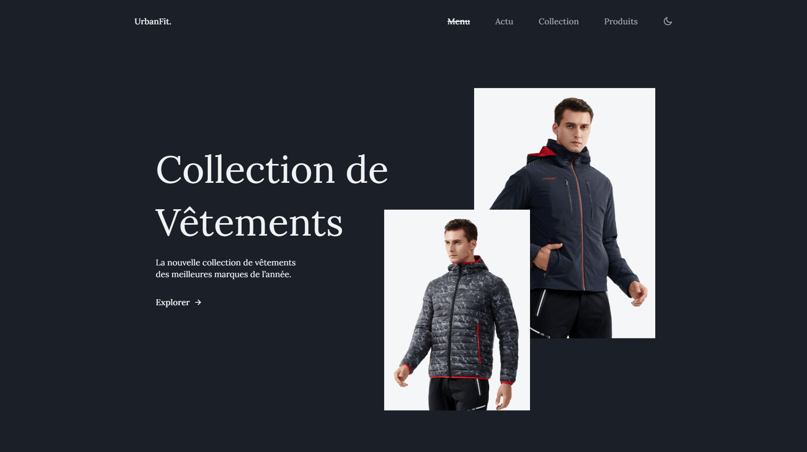

<div align="center">  
    <a href="https://clothing-store-vm.netlify.app/" target="_blank">  
        
    </a>
    </br>  
    </br>  
  <h3 align="center">🧥 UrbanFit. &nbsp; — &nbsp; Boutique de Vêtements </h3>  
</div>

## <br /> 📌 Sommaire

&nbsp;&nbsp;&nbsp; 🎨 &nbsp; [**Introduction**](#introduction)<br />
&nbsp;&nbsp;&nbsp; 🛠️ &nbsp; [**Technologies**](#technologies)<br />
&nbsp;&nbsp;&nbsp; 🎯 &nbsp; [**Fonctionnalités**](#fonctionnalités)<br />
&nbsp;&nbsp;&nbsp; 🚀 &nbsp; [**Installation**](#installation)<br />

## <br /> <a name="introduction">🎨 Introduction</a>

UrbanFit est une landing page e-commerce moderne et responsive, conçue pour mettre en avant une collection textile avec animations, sliders et thème sombre. Elle intègre un menu interactif, des nouveautés, des collections homme et femme, un carrousel produit, des marques partenaires et un footer complet. Design fluide, idéal pour un projet mode.

## <br /> <a name="technologies">🛠️ Technologies</a>

- HTML5 sémantique et structuration claire
- CSS3 moderne avec variables, media queries et animations
- JavaScript ES6 clair et modulaire
- [Swiper.js](https://swiperjs.com/) pour les carrousels produits
- [ScrollReveal](https://scrollrevealjs.org/) pour des animations au scroll
- [Remix Icons](https://remixicon.com/) pour des icônes vectorielles modernes
- Responsive Design pensé en mobile-first

## <br /> <a name="fonctionnalités">🎯 Fonctionnalités</a>

- Section Accueil avec images superposées et slogan
- Section Nouveautés avec 3 catégories cliquables
- Présentation Homme et Femme en split layout
- Carrousel Meilleurs Produits avec navigation Swiper
- Logos des marques partenaires
- Changement de thème clair et sombre avec mémorisation locale
- Navigation sticky avec scroll dynamique & active link
- Bouton de retour en haut animé
- Footer complet : entreprise, blog, horaires, réseaux sociaux
- Code 100% HTML/CSS/JS, sans framework lourd

## <br /> <a name="installation">🚀 Installation</a>

### ✅ Prérequis

- [Google Chrome](https://www.google.com/) &nbsp;—&nbsp; Navigateur moderne
- [Visual Studio Code](https://code.visualstudio.com/) &nbsp;—&nbsp; Éditeur de code
- [Live Server](https://marketplace.visualstudio.com/items?itemName=ritwickdey.LiveServer) &nbsp;—&nbsp; Extension VS Code

### 📥 Cloner le projet

```bash
git clone git@github.com:ValentinMadiot/clothing-store_ui
cd clothing-store_ui
```

### ▶️ Lancer le projet

Il suffit d’ouvrir le fichier `index.html` dans un navigateur, ou d’utiliser l’extension **Live Server** sur VS Code pour un aperçu dynamique.
